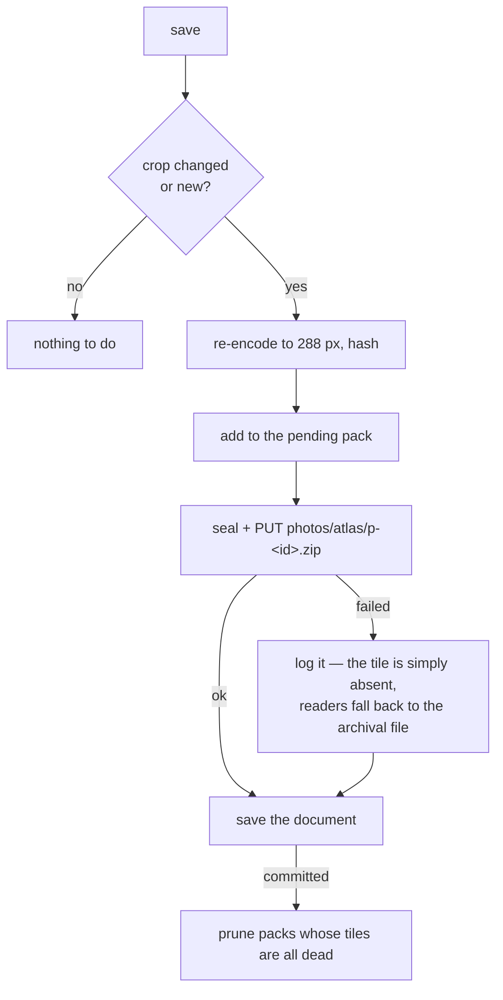

# Design note — the photo atlas

> **Status: proposal.** Nothing here is shipped. This is a design sketch for
> replacing the one-file-per-photo cloud layout with a two-tier scheme: a small
> **atlas** of downscaled crops that every device fetches on open, and
> full-resolution originals that are fetched only when something actually needs
> them. Written up so the trade-offs can be argued about before any code moves.
> The behaviour users have today is described in [sync](../sync.md#photo-files).

## The problem

On a plaintext cloud backend every image a contact carries is filed out as its
own binary JPEG (`photoStore.ts`, `photo.ts`):

```
photos/anna-svensson-4k2p-1.jpg          the display crop, 512×512
photos/anna-svensson-4k2p-1-source.jpg   the original, longest edge ≤ 1024
```

Two files per gallery photo, per contact. A 300-contact book where cards
average 1.4 photos is **~840 files, ~84 MB** (a 512² q0.85 crop is ~50 KB; a
≤1024 px source ~150 KB). That layout is lovely to browse and self-healing
(the file name names its contact), but it is hostile to a cloud API:

| Operation               | Requests today                 | Why it hurts                                            |
| ----------------------- | ------------------------------ | ------------------------------------------------------- |
| Cold open, fresh device | ~840 GETs (4 at a time)        | Dropbox answers `429`, WebKit starts refusing sockets   |
| Save after a rename     | up to 2×N PUTs + 2×N DELETEs   | the path embeds the name slug, so renaming re-files all |
| Every save              | 1 LIST (+ DELETEs for orphans) | listing an 840-entry folder on every save               |

The **request rate** is the problem, not the bytes. Commit `45eedb2` had to
teach the prune not to delete photos when a throttle lands mid-save; that fix
is sound, but it treats a symptom of a layout that asks for hundreds of
round-trips.

A second flaw: the path is derived from the contact's _name_ and the photo's
_gallery position_. Rename a contact, or drag a photo to the front of its
gallery, and every file underneath it is rewritten and the old one pruned — a
full re-upload of bytes that did not change.

## The insight

Look at what each stored image is actually _for_:

| Stored image  | Size stored   | Where it renders                         | Largest it is ever drawn        |
| ------------- | ------------- | ---------------------------------------- | ------------------------------- |
| `photo`       | 512×512 JPEG  | every avatar (list rows, header, hero)   | **96 CSS px** (`hero`)          |
| `photoSource` | ≤1024 px JPEG | the lightbox, and re-opening the cropper | full screen — but only on a tap |

The avatar sizes are the framework's `xs`/`sm`/`md`/`lg`/`xl` — 20, 40, 48, 64,
and **96** CSS px — and `ContactIdentity.tsx` hands the lightbox
`photoSource || photo`, so the source is what gets shown big.

Two things follow, and together they are the whole design:

1. **The crop is ~5× over-resolution for its only job.** At 3× device pixel
   ratio the largest avatar needs 288 px. We ship 512 and never draw it above
   96 CSS px.
2. **The source is never needed on open.** Nothing renders it until the user
   taps a photo or re-crops it. Today we eagerly download all 420 of them —
   63 of the 84 MB, and half the requests — to satisfy a case that mostly
   never happens.

So: **tier the transport.**

| Tier         | What                                      | Fetched                | Cost for the 300-contact book |
| ------------ | ----------------------------------------- | ---------------------- | ----------------------------- |
| **Render**   | every crop, downscaled to 288 px, batched | eagerly, on open       | ~3 requests, ~6 MB            |
| **Archival** | the full-resolution original, one file    | lazily, on tap/re-crop | 1 request, when it happens    |

Cold open on a fresh device goes from **~840 requests / 84 MB** to **~7
requests / ~6 MB**. That is the headline, and the tiering — not the container
format — is where it comes from.

## The render tier (the atlas)

Every contact's display crop, downscaled to **288 px** (96 CSS px × 3 DPR —
exactly enough for the largest avatar on the densest phone), batched into a
handful of files under `photos/atlas/`.

### Sheet or pack?

The crops are uniform squares of identical dimensions, which is the one case
where a literal sprite sheet is genuinely easy — no rect packing, the index is
an ordinal.

**A. A sprite sheet** — one big JPEG, tiles in a grid, sliced with
`createImageBitmap(blob, sx, sy, sw, sh)`.

- One decode paints the whole list.
- Shared Huffman tables across tiles buy maybe 10–20% over separate JPEGs.
- **It is a contact sheet you can look at** — open `atlas/1.jpg` in the drive
  and see everybody. That fits this app's photos-are-real-files philosophy.
- Bounded by canvas area: iOS Safari caps at 16.7 Mpx, so a sheet is at most
  ~200 tiles at 288 px (14×14 = 196, a 4032×4032 image). Three sheets for the
  book above.
- Updating one photo means re-encoding a sheet of 196.

**B. A pack** — a ZIP of 288 px JPEGs named by content hash (the framework
already ships `createZip`/`readZip`, and `backup.ts` uses them).

- No canvas, no slicing, no decode ceiling, no re-encode of neighbours.
- Incremental: a new photo can go into a new small pack.
- Content-addressable, so packs are immutable and never collide.
- Individual entries stay previewable if you unzip.

**Both land at ~3 requests and ~6 MB — the choice is ergonomics, not
performance.** Recommendation: **B (packs)**, because incremental updates
matter more day-to-day than the contact-sheet party trick, and because
immutability makes the concurrency story trivial (below). If the browsable
contact sheet is worth more to you than incremental writes, A is defensible and
the rest of this design is unchanged.

Either way the crop is **re-encoded down to 288 px** for this tier. That is
lossy, and it is fine — the tier is a derived render cache, and the
full-resolution bytes live in the archival tier untouched.

### The atlas is derived and disposable

This is the property that makes everything else easy. A pack holds nothing that
cannot be regenerated from the archival tier. So:

- **It stays out of the document.** Each pack carries its own `index.json`
  (`ordinal / hash → {contactId, entryId}`), so the atlas is self-describing.
  The document does not gain a field, and a rebuild touches no contact record.
- **A missing, stale, or corrupt tile is not an error.** It degrades to a
  lazy fetch of that photo's archival file — the same path a photo added on
  another device takes before the next atlas write. The avatar is never broken,
  only occasionally slower.
- **Losing the whole atlas costs a rebuild, not data.**

### Read path

On open: list `photos/atlas/` (1 request), fetch each pack (~3), unzip, and
hand the tiles to the existing `mergeInlineMedia` seam (`mediaHydrate.ts`).
Tiles land in the IndexedDB media cache (`mediaCache.ts`) keyed the way it
already keys media, so this is a once-per-device cost, not a once-per-open one.
`MEDIA_CONCURRENCY` and `withRetries` (`cloudRetry.ts`) are unchanged — they
now govern a handful of requests instead of hundreds.

Any photo entry with no tile in any pack falls through to the archival tier.

### Write path



A failed atlas write is a non-event: no photo is at risk, because the atlas
never holds the only copy of anything.

## The archival tier

The full-resolution bytes — `photoSource`, or `photo` when a card has no source
— stay as **one loose file per photo**, exactly as today. What changes is only
_when_ they are fetched: on demand, not on open.

Keeping this tier as loose files is deliberate. It preserves everything the
current layout is good at and the docs advertise: real previewable JPEGs in the
drive, deterministic names, the hand-drop inbox, and the self-healing
reconcile via `parsePhotoPath`. The atlas gets the request-count win; the
archival tier keeps the browsability.

**The one photo that must not be downscaled**: a card whose photo arrived
inline on an imported vCard has a `photo` and no `photoSource`. Its crop _is_
the only full-resolution copy, so it is filed to the archival tier at full size
like a source, and separately downscaled into the atlas. Rule: **every photo
has exactly one full-resolution file on the drive, plus one tile in the atlas.**
Nothing is ever stored only in downscaled form.

Lazy fetch triggers:

- the lightbox opening on a photo whose source is not local,
- the cropper re-opening on a photo,
- an explicit "download all photo originals" action, for a device that wants to
  go properly offline (worth a Developer or Storage setting).

Known trade-offs, both worth naming in the user docs:

- Re-cropping a photo on a fresh device needs a network round-trip.
- Offline on a fresh device, the lightbox shows the 288 px tile rather than the
  original. Fine at avatar size, soft when zoomed.

## Concurrency — why no lock files

The original sketch reached for a master atlas, a spec file, a log, and locks.
What each becomes:

| Sketched           | Proposal                            | Why                                                                                                                           |
| ------------------ | ----------------------------------- | ----------------------------------------------------------------------------------------------------------------------------- |
| One master atlas   | Several immutable packs             | A master atlas is rewritten in full on every photo change, and two devices editing at once always conflict on it.             |
| An atlas spec JSON | A per-pack `index.json`             | The atlas is derived, so its index belongs with the thing it indexes — not in the document, and not in a shared mutable file. |
| A log              | Nothing (plus the existing log tab) | An append-only log on Dropbox/Drive is a full read-modify-write of one file — the same conflict it was meant to solve.        |
| Lock files         | Nothing                             | See below.                                                                                                                    |

Locks are the wrong primitive here. Neither provider offers an atomic
create-if-absent to build a lease on; a crashed or offline holder wedges every
other device behind a TTL you cannot verify across devices with skewed clocks;
and this app is offline-first — a device that cannot reach the drive cannot
release a lock, and a device that cannot take one must still let the user edit.

The design avoids needing one entirely:

- **Pack writes cannot conflict.** Immutable and content-named: two devices
  either write identical bytes to the same path, or different bytes to
  different paths.
- **The only mutable shared thing is the document**, which already rides
  optimistic concurrency — `ConflictError`, the header glyph, the
  reload-and-resolve flow in `useSyncEngine.ts`.
- **Any race degrades, it does not break.** Worst case, two devices each write a
  pack containing the same tile: a few wasted KB until compaction. Or a tile is
  briefly missing: that photo falls back to a lazy archival fetch.

Where a provider does offer a precondition the pack write should use it —
Dropbox's `files/upload` takes `mode: {".tag": "update", "update": "<rev>"}`.
Drive v3 has no documented `If-Match` on `files.update`, so treat CAS as a
nice-to-have. Immutability is what makes it unnecessary.

## Deletion and compaction

Deleting a photo leaves a dead tile inside a pack that is never rewritten — the
usual log-structured trade, and cheap here because tiles are ~15 KB.

**Prune** — a pack whose tiles are _all_ dead is removed after the save
commits, under the existing completeness guard. This is the shipped orphan
prune, counting packs.

**Compaction** — when live tiles across the atlas drop below ~50%, rebuild:
re-encode from the local working copy, write fresh packs, prune the old ones.
Because the atlas is derived, compaction is just "regenerate", and a device
that is itself missing crops simply does not qualify to run it.

There is no offline-device hazard on this tier at all — deleting a pack another
device still references costs that device a lazy archival fetch, not a photo.
(The archival tier keeps today's prune rules unchanged, including the
prune-only-from-a-complete-picture guard from `45eedb2`.)

## What stays exactly as it is

- **The local folder backend.** A picked directory has no rate limit and no
  429s, and a browsable tree of real JPEGs is the whole point of that backend
  (see [local folder](../features/local-folder.md)). No atlas there; if
  anything, it should keep eagerly filing both tiers.
- **Encrypted backends.** Photos stay inside the AES-GCM envelope; no
  externaliser runs.
- **The local working copy and its caches.** localStorage inline data URIs and
  the IndexedDB media cache are untouched, except that the cache now also holds
  atlas tiles.
- **Attachments.** Out of scope — they have no render tier and no over-
  resolution problem, so lazy fetch is the only idea here that applies to them,
  and it applies unchanged.

## Migration and rollout

Nothing in the atlas tier changes the document, so most of this is
uncomplicated — the atlas can appear on a drive and older builds will simply
ignore it and keep eagerly reading loose files.

The one behavioural change that needs care is **going lazy on sources**, since
a build that stops fetching them relies on being able to fetch one on demand.
Sequence:

1. **Ship lazy sources first, on its own.** Halves cold-open requests
   (840 → 420) and ~75% of the bytes, with no new format anywhere. If this alone
   makes the 429s go away, the rest is optional.
2. **Then the atlas**, behind a Developer toggle, writing packs alongside the
   existing loose files and reading tiles when present.
3. **Then stop eagerly reading crops**, once the atlas has proven itself on a
   real book.

Step 1 is worth doing whatever happens to steps 2 and 3 — it is the cheapest
large win in the whole note.

## Failure modes

| Failure                         | Behaviour                                                                        |
| ------------------------------- | -------------------------------------------------------------------------------- |
| Atlas pack upload fails         | Logged. Tiles are absent; readers fall back to lazy archival fetches. No loss.   |
| Atlas pack download fails       | Falls back to lazy archival fetches for those contacts. Avatars fill in slower.  |
| Pack corrupt / `readZip` throws | Same as a failed download — never treated as "these photos were deleted".        |
| Archival file missing on tap    | Lightbox shows the 288 px tile; logged, and re-uploaded if the device has bytes. |
| Two devices write the same tile | Two packs, one duplicate. A few wasted KB until compaction.                      |
| Document conflict               | Existing flow, untouched — the atlas is not in the document.                     |

## Phases

| Phase | Scope                                                                                                                       | Rough size         |
| ----- | --------------------------------------------------------------------------------------------------------------------------- | ------------------ |
| 1     | **Lazy sources.** Skip `photoSource` in the eager rehydrate; fetch on lightbox/cropper open; a "download originals" action. | ~200 lines + tests |
| 2     | `atlasPack.ts` (build/parse, 288 px re-encode, hash, index) + tests. Read path behind a flag.                               | ~350 lines + tests |
| 3     | Atlas write path, prune, Developer toggle, docs + changeset.                                                                | ~250 lines         |
| 4     | Compaction, and stop eagerly reading loose crops.                                                                           | ~150 lines         |

Files that move: `src/app/photoStore.ts` (split — the eager rehydrate learns
about tiers), `src/app/mediaHydrate.ts` (tile-aware merge),
`src/app/mediaCache.ts` (a `tile` media kind), `src/app/ContactIdentity.tsx` and
the cropper entry points (lazy source fetch), `src/app/useSyncEngine.ts`
(composition only), `docs/sync.md`, `docs/features/photo-files.md`.

Tests, pure and node-run per the repo's conventions (`tests/atlas_pack_test.ts`,
`tests/atlas_index_test.ts`, `tests/atlas_gc_test.ts`): pack round-trip, index
parse/format, tile-to-entry resolution, live-set and compaction selection, and
the fallback rule (an entry with no tile resolves to its archival path).

## Open questions

1. **Tile size.** 288 px covers 96 CSS px at 3× DPR exactly. 256 would be ~20%
   smaller and very slightly soft on the densest phones at hero size; 384 buys
   headroom for a future larger avatar. Worth eyeballing on a real device
   before committing.
2. **Sheet or pack** for the render tier — performance is a wash, so it comes
   down to whether a browsable contact sheet in the drive is worth losing
   incremental writes.
3. **Does the 512 px crop need to sync at all?** Once the atlas holds a 288 px
   tile and the archival tier holds the source, the 512 crop is re-bakeable
   locally from the source plus `photoTransform`. Dropping it would remove the
   ~21 MB middle tier entirely — but only for photos that _have_ a source.
4. **Should lazy fetch be pre-emptive?** Prefetching the sources of the contacts
   currently on screen would make the lightbox feel instant, at the cost of the
   request discipline this whole note is about.
