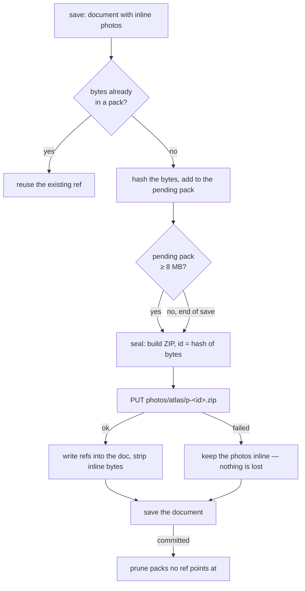

# Design note — the photo atlas

> **Status: proposal.** Nothing here is shipped. This is a design sketch for
> replacing the one-file-per-photo cloud layout with a small number of packed
> "atlas" files, written up so the trade-offs can be argued about before any
> code moves. The behaviour users have today is described in
> [sync](../sync.md#photo-files).

## The problem

On a plaintext cloud backend every image a contact carries is filed out as its
own binary JPEG (`photoStore.ts`, `photo.ts`):

```
photos/anna-svensson-4k2p-1.jpg          display crop, gallery position 1
photos/anna-svensson-4k2p-1-source.jpg   the larger original
```

Two files per gallery photo, per contact. A 300-contact book where cards
average 1.4 photos is **~840 files**. That layout is lovely to browse and
self-healing (the file name names its contact), but it is hostile to a cloud
API:

| Operation               | Requests today                 | Why it hurts                                            |
| ----------------------- | ------------------------------ | ------------------------------------------------------- |
| Cold open, fresh device | ~840 GETs (4 at a time)        | Dropbox answers `429`, WebKit starts refusing sockets   |
| Save after a rename     | up to 2×N PUTs + 2×N DELETEs   | the path embeds the name slug, so renaming re-files all |
| Every save              | 1 LIST (+ DELETEs for orphans) | listing a 840-entry folder on every save                |

The bytes are not the problem — ~190 MB moves either way. The **request rate**
is. Commit `45eedb2` had to teach the prune not to delete photos when a throttle
lands mid-save; that fix is sound, but it is treating a symptom of a layout that
asks for hundreds of round-trips.

The second flaw is that the path is derived from the contact's _name_ and the
photo's _gallery position_. Rename a contact, or drag a photo to the front of
its gallery, and every file underneath it has to be rewritten and the old one
pruned — a full re-upload of bytes that did not change.

## The idea

Keep photos as separate files locally (localStorage working copy + the
IndexedDB media cache, unchanged), and sync them as a handful of **packs**
instead of hundreds of loose files. A device that already has the bytes never
downloads them; a device that is missing photos fetches a few packs instead of
a few hundred JPEGs.

### Which container?

Two readings of "atlas", and they are not the same thing:

**A. A literal sprite sheet** — stitch the photos into one big image, keep a
JSON of `{x, y, w, h}` rects, draw sub-rects to a canvas.

- Re-encodes every photo → generation loss, and CPU on a phone.
- Wastes space packing rects of wildly different sizes (a 3000 px original
  next to a 512 px crop).
- Runs into decode limits — iOS Safari refuses canvases past ~16.7 M pixels, so
  a book needs several sheets anyway.
- But it is a real image you can look at, and one decode paints a whole list.

**B. A pack file** — concatenate the original JPEG bytes into one archive with
an index.

- Byte-exact: no re-encode, no quality loss, nothing to decode until a photo is
  actually shown.
- Handles any mix of sizes, and generalises to attachments unchanged.
- The framework already ships a ZIP reader/writer
  (`@niclaslindstedt/oss-framework/zip`, already used by `backup.ts`), and a
  ZIP of JPEGs stores them uncompressed — so a pack _is_ a concatenation plus a
  central directory, and a human can still open it in any file manager.

**Recommendation: B for the real photo bytes.** A sprite sheet earns its keep in
exactly one place — a tiny sheet of 96 px avatar thumbnails for instant list
paint on a fresh device — which is worth doing later as its own thing
(["phase 3"](#phases)), not as the transport for the pictures themselves.

## Shape of the proposal

### On the drive

```
contacts-default.json           the document (unchanged)
photos/
  atlas/
    p-8f3a91c40b25de17.zip      an immutable pack
    p-c7710d5e2a9b3f04.zip
  anna-svensson-4k2p-1.jpg      loose files: legacy + hand-drop inbox
attachments/…                   unchanged for now
```

A **pack** is a ZIP holding:

```
index.json                      what is in here, and where each entry came from
9c1f…7b2e.jpg                   one entry per image, named by content hash
04ab…33d9.jpg
```

`index.json` inside the pack:

```json
{
  "version": 1,
  "entries": {
    "9c1f…7b2e": {
      "bytes": 61204,
      "contactId": "c_18…",
      "entryId": "ph_9…",
      "kind": "photo"
    },
    "04ab…33d9": {
      "bytes": 412887,
      "contactId": "c_18…",
      "entryId": "ph_9…",
      "kind": "photoSource"
    }
  }
}
```

Three properties do all the work:

1. **Content-addressed.** An entry's name is `sha256(bytes)` truncated to 16
   hex chars (`crypto.subtle.digest`). Identical bytes are one entry — a photo
   reused on two cards, or a crop that survived a re-save, is stored once.
2. **Immutable.** A pack is never rewritten. Its id is the hash of its own
   bytes, so two devices that build the same pack write the same file, and two
   devices that build different packs cannot collide.
3. **Self-describing.** The pack's `index.json` says which contact and which
   gallery entry each image belongs to, so the self-healing reconcile survives
   without file names having to carry it.

Packs are capped at ~8 MB, so the ~190 MB book above is ~25 packs. **840
requests becomes ~25.**

### In the document

`ContactPhoto` (`src/app/types.ts`) grows a ref beside the existing path:

```ts
export type ContactPhoto = {
  id: string;
  photo?: string | null;
  photoSource?: string | null;
  photoTransform?: PhotoTransform | null;
  photoPath?: string | null; // legacy loose file — read-only after migration
  photoSourcePath?: string | null; // legacy loose file — read-only after migration
  photoRef?: string | null; // "p-8f3a91c40b25de17:9c1f…7b2e"
  photoSourceRef?: string | null;
};
```

A ref is `<packId>:<hash>` — enough to fetch the bytes with no other lookup.

**This is the part that answers the "atlas spec JSON" question.** There is no
shared mutable index file on the drive. The document _is_ the index: it already
syncs, it already has optimistic concurrency, conflict detection, and a
resolution UI (`useSyncEngine.ts`). Adding a second mutable coordination file
would mean inventing a second, weaker copy of machinery that already exists.

Because the refs are content-addressed, **a rename or a photo reorder changes
nothing on the drive.** That whole class of churn — and the `needsRefile` /
re-file / prune dance in `photoStore.ts` — disappears.

### Write path



The three safety rules in `photoStore.ts` carry over verbatim, and get a little
stronger:

- **Externalise-or-embed** — a photo's bytes are stripped from the outgoing
  document only after its pack write succeeds. Now the unit is a pack rather
  than one photo, so a failed write keeps a handful of photos inline together.
- **Prune after commit** — packs are only removed once the document save has
  committed.
- **Prune only from a complete picture** — unchanged, and cheaper to satisfy:
  one failed pack write stands the prune down, and there are ~25 things to
  reason about rather than ~840.

### Read path

On load, for each photo entry the working copy is missing bytes for: group the
refs by pack, fetch each needed pack once, unzip, hand the bytes to the
existing `mergeInlineMedia` seam (`mediaHydrate.ts`). `MEDIA_CONCURRENCY` and
`withRetries` (`cloudRetry.ts`) stay exactly as they are — they now govern a
couple of dozen requests instead of hundreds, which is the point.

A device that is missing _one_ photo still pulls its whole 8 MB pack. Two
mitigations, in order of cost:

1. Pack in document order, so a card's crop and source land in the same pack
   and neighbouring contacts cluster — a partial fetch is coherent.
2. Later: `Range` requests. Both providers' content endpoints honour `Range`,
   and a ZIP is readable back-to-front (end-of-central-directory → central
   directory → one local entry), so a single photo is 2–3 small ranged reads.
   The framework's `readZip` reads a whole archive, so this needs a small
   app-local central-directory reader. Defer to phase 4; measure first.

## Concurrency — why no lock files

The user's sketch reached for a master atlas, a spec file, a log, and locks.
Here is what each becomes, and why:

| Sketched           | Proposal                            | Why                                                                                                                               |
| ------------------ | ----------------------------------- | --------------------------------------------------------------------------------------------------------------------------------- |
| One master atlas   | Many immutable packs                | A master atlas is rewritten in full on every photo change — tens of MB per save, and two devices editing at once always conflict. |
| An atlas spec JSON | Refs in the document                | The document already has revisions, conflict detection, and a resolution UI. A second mutable file needs its own, weaker, copy.   |
| A log              | Nothing (plus the existing log tab) | An append-only log on Dropbox/Drive is a full read-modify-write of one file — the same conflict it was meant to solve.            |
| Lock files         | Nothing                             | See below.                                                                                                                        |

Locks are the wrong primitive here. Neither Dropbox nor Drive gives you an
atomic create-if-absent to build a lease on, a crashed or offline holder wedges
every other device until a TTL you cannot verify (clock skew across devices is
real), and the app is offline-first — a device that cannot reach the drive
cannot release a lock, and a device that cannot take one must still let the
user edit.

The design avoids needing one:

- **Pack writes never conflict.** Immutable and content-named: two devices
  either write the same bytes to the same path (idempotent) or different bytes
  to different paths (disjoint).
- **The one mutable thing is the document**, and it already rides optimistic
  concurrency — `ConflictError`, the header glyph, and the reload/resolve flow.
  A photo added on two devices at once ends up as two packs on the drive and
  one document conflict, resolved the way document conflicts already are.
- **The loser of a conflict loses nothing.** Its bytes are still on the device
  (working copy + IndexedDB cache) and its pack is still on the drive; the next
  save re-refs them.

Where the drive _does_ offer a precondition, the pack write should use it —
Dropbox's `files/upload` takes `mode: {".tag": "update", "update": "<rev>"}`.
Drive v3 has no documented `If-Match` on `files.update`, so treat CAS as a
nice-to-have, not a load-bearing assumption. Immutability is what makes it
unnecessary.

## Deletion and compaction

Deleting a photo leaves dead bytes inside a pack that is never rewritten — the
classic log-structured trade. Two mechanisms handle it:

**Prune** — a pack no ref in the document points at is dead and is removed
after the save commits, under the existing completeness guard. This is the
already-shipped orphan prune, counting packs instead of files.

**Compaction** — when a pack's live fraction (live entry bytes ÷ pack bytes,
computed from the refs plus the pack's own `index.json`) drops below ~50%, the
device rebuilds its live entries into a fresh pack, rewrites the refs, saves,
and the prune above collects the old pack.

The crucial detail: **the compacting device builds the new pack from its own
local inline bytes** — it never downloads the old pack to repack it. So
compaction costs one upload and one delete, not a round trip of the whole
archive. A device that is itself missing bytes simply does not qualify to
compact.

The offline-device hazard — device B is offline holding refs to a pack device A
just collected — self-heals: B still has the bytes locally, so its next save
files them into a new pack. If that guarantee ever feels too thin, the
hardening step is a retirement list in the document (`{pack, retiredAt}`) with
a two-week grace period before the delete; start without it and see whether the
logs ever show a miss.

## What stays as loose files

- **The local folder backend keeps one file per photo.** A picked directory has
  no rate limit and no 429s, and a browsable, git-trackable tree of real JPEGs
  is the entire point of that backend (see [local folder](../features/local-folder.md)).
  Packs are a cloud answer to a cloud problem.
- **`photos/` stays an inbox on cloud backends too.** Any loose file found there
  is still parsed by `parsePhotoPath`, adopted onto its contact, folded into a
  pack on the next save, and then pruned — so hand-dropping a photo into the
  drive keeps working, and legacy files migrate by the same path.
- **Encrypted backends are untouched.** Photos stay inside the AES-GCM envelope;
  no externaliser runs at all.
- **Attachments are unchanged in v1.** The pack format generalises to them
  directly (same store shape, same seam) — worth doing once photos have proven
  it, not in the same change.

## Migration and rollout

The document gains a field older builds do not understand, and an older build
that opens a packed document sees photos vanish. That makes rollout, not the
format, the risky part. Two releases:

**Release 1 — read.** Understands `photoRef` and can fetch packs; still writes
loose files. Nothing on any drive changes. This is what makes the second
release safe: by the time packs appear, every device that has updated in the
interim can already read them.

**Release 2 — write.** Behind a Developer setting first, then on by default.
On save, photos are packed; the loose files they came from are pruned only
after the save commits _and_ the bytes are confirmed inside a pack. The first
packing run needs **no downloads** — the device already holds every byte
inline, so migration is upload-only.

Both releases must keep reading `photoPath` / `photoSourcePath` indefinitely;
they cost nothing to support and are the fallback when a ref cannot be
resolved.

## Failure modes worth naming

| Failure                              | Behaviour                                                                                        |
| ------------------------------------ | ------------------------------------------------------------------------------------------------ |
| Pack upload throttled / fails        | Photos stay inline in the document. Prune stands down for that save. No loss.                    |
| Pack download fails                  | `mergeInlineMedia` leaves the working copy's bytes alone; entry keeps its ref.                   |
| Ref points at a pack that is gone    | Logged; if the device holds the bytes it re-packs them, else the avatar falls back to the glyph. |
| Pack is corrupt / `readZip` throws   | Logged, treated as a failed download — never as "these photos are deleted".                      |
| Two devices pack the same photo      | Two packs, one duplicated entry. Wasted bytes until compaction; not an error.                    |
| Document conflict with packs on both | Existing conflict flow. Both packs survive; the losing side re-refs on next save.                |

## Phases

| Phase | Scope                                                                                                                                 | Rough size         |
| ----- | ------------------------------------------------------------------------------------------------------------------------------------- | ------------------ |
| 1     | `atlasPack.ts` (build/parse a pack, hash, index), `atlasStore.ts` (the ref-aware externaliser), tests. Read path only, behind a flag. | ~500 lines + tests |
| 2     | Write path, prune-by-pack, migration from loose files, Developer toggle, docs + changeset.                                            | ~300 lines         |
| 3     | Compaction, and (separately) the 96 px thumbnail sprite sheet for instant first paint.                                                | ~250 lines         |
| 4     | `Range`-based single-entry reads, if measurement says the whole-pack fetch hurts.                                                     | ~150 lines         |

Files that move: `src/app/photo.ts` (ref parsing beside path parsing),
`src/app/photoStore.ts` (split — the externaliser grows a pack backend),
`src/app/types.ts`, `src/app/mediaHydrate.ts` (ref-keyed merge),
`src/app/useSyncEngine.ts` (composition only), `docs/sync.md`,
`docs/features/photo-files.md`.

Tests, all pure and node-run per the repo's conventions
(`tests/atlas_pack_test.ts`, `tests/atlas_ref_test.ts`,
`tests/atlas_gc_test.ts`): pack round-trip byte-exactness, hash stability, ref
parse/format, live-set and compaction selection from a document + pack indexes,
and the dual-read migration (a document holding both `photoPath` and
`photoRef`).

## Open questions

1. **Pack size.** 8 MB is a guess balancing request count against how much a
   device over-fetches for one photo. Worth measuring against a real book.
2. **Do we still need `photoSource`?** The document stores `photoTransform`, so
   the display crop is _derivable_ from the source. Dropping the crop from the
   drive halves what syncs and would compose beautifully with packs — but it
   costs a canvas bake per photo on load and breaks down for imported photos
   that never had a source. Separate proposal; flagging the interaction.
3. **Grace period.** Ship compaction with the retirement list from the start, or
   trust the local-bytes self-heal and add it only if logs show a miss?
4. **Attachments.** Same packs, or their own? A 40 MB PDF does not want to share
   a pack with anything.
